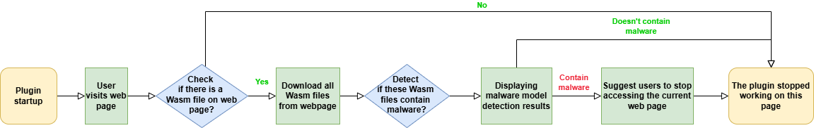
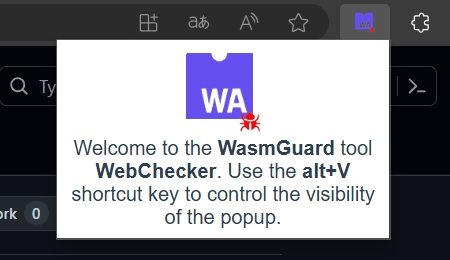
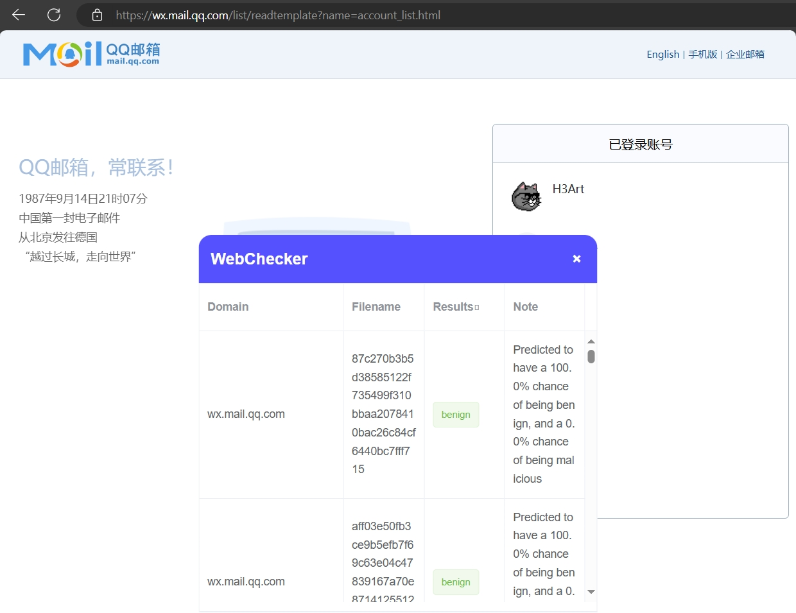
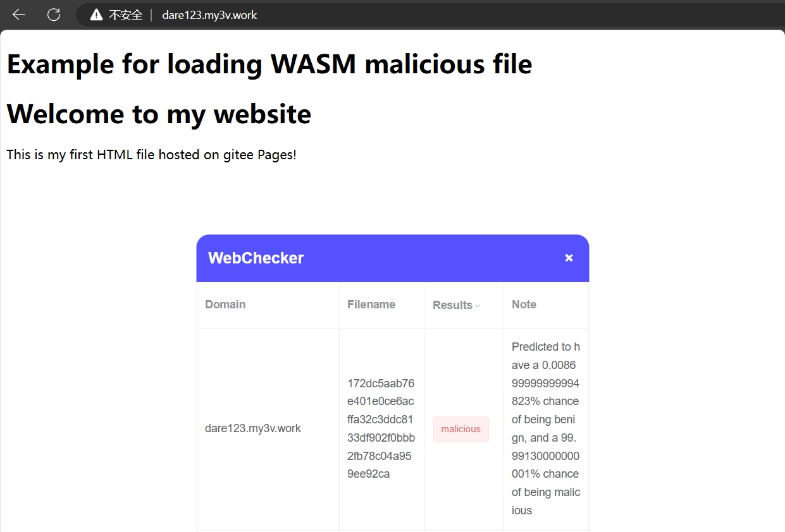

# WebChecker——A WasmGuard-based Detector Plugin

<div align="center">
  <br>
  Stay Safe, Browse Smart – With WebChecker.
</div>

## 🤗Introduction

### 🤔What is WebChecker?

WebChecker is a **Chrome browser plugin** based on **WasmGuard**, designed to alert users about malicious WebAssembly (Wasm) files. Since some detection methods struggle in adversarial environments, our work, ***WasmGuard: Robust Raw-Binary Detection of WebAssembly Malware with Prior and Contrastive Adversarial Training*** offers a robust solution, achieving high accuracy even under attack.

WebChecker works according to the following process:



### 😮Demo

When launching WebChecker, users are greeted with a popup that introduces the tool and its quick-access features.

<div align="center">
  <br>
</div>

When a webpage is analyzed, WebChecker displays a panel listing the detected Wasm files, their domain, filename, and a detailed result indicating whether the file is benign or malicious.

<div align="center">
  <br>
</div>

<div align="center">
  <br>
</div>

## 🥳Get Started

### 😎Download and Installation

On our Github Release page, you can find the built WebChecker binary file with the suffix **.crx**.

To install **.crx** files into the browser, you can use the following methods:

- **Installation method 1**: Double-click the CRX file directly, confirm the addition according to the prompt, and you can restore the plugin to the browser.

- **Installation method 2**: Drag the CRX file to the browser plugin bar to quickly complete the installation.

- **Installation method 3**: Change the extension file suffix **.crx** to **.rar** or **.zip**, so that it becomes a compressed file. Unzip the file to get a folder, then enter the browser extension management page, select **"Load unzipped extension"**, select the folder just unzipped to load, and the installation is complete.

### 💪Manual Installation

Run the following command to install dependencies:

```sh
npm i
```

To build the project, use:

```sh
npm run build
```

**Note:** If you've made changes to the `panel` or `popup` components, you'll need to navigate to their respective directories and rebuild them individually.

For the `panel`:

```sh
cd ./panel
npm run build
```

For the `popup`:

```sh
cd ./popup
npm run build
```

Finally, you can see some new files and folders generated in the source code directory. Use the **Installation method 3** mentioned in the [Download and Installation](#download-and-installation) section to load the **dist** folder to start using the plugin.

## 😉Citation
If you find this project useful in your research or work, please consider citing it.
```bibtex
To be released
```
